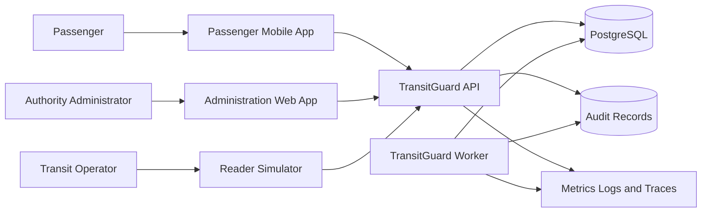

# TransitGuard System Architecture

## 1. Purpose

TransitGuard is a production-oriented Rust platform that simulates secure
transit fare processing for a fictional transit authority.

The system models:

- Transit cards and mobile credentials
- Fare readers and registered equipment
- Stored-value balances and transit passes
- Transfers and fare capping
- Online and offline fare validation
- Delayed transaction synchronization
- Duplicate detection and idempotency
- Transaction reconciliation
- Credential revocation
- Audit logging and operational telemetry

All protocols, cards, readers, credentials, keys, transactions, and
transit-authority systems are fictional and owned by this project.

## 2. Architectural approach

TransitGuard begins as a modular Rust system with several deployable
applications sharing strongly separated domain libraries.

This approach provides:

- Explicit domain boundaries
- Independent testing of business rules
- Reusable application components
- Separate executable processes where operationally useful
- A controlled path toward additional services without premature
  microservice complexity

The system will not begin as a large collection of networked microservices.

Boundaries will first be enforced inside the Rust workspace. A component will
become an independently deployed service only when scaling, security,
availability, operational isolation, or ownership requirements justify that
separation.

The initial design follows these principles:

- Domain rules remain independent from infrastructure.
- Deployable applications coordinate work but do not own core business rules.
- Database records do not become the domain model.
- Security checks are applied at every trust boundary.
- Offline behavior is deterministic, bounded, and auditable.
- Failed operations preserve enough evidence for investigation.
- All simulated credentials and protocols remain project-owned.

## 3. System context



The external actors are:

- Passengers using fictional transit credentials
- Transit operators using simulated reader equipment
- Authority administrators managing the fictional transit platform

The primary system components are:

- Passenger mobile application
- Administration web application
- Reader simulator
- TransitGuard API
- TransitGuard background worker
- PostgreSQL database
- Audit-record storage
- Metrics, logs, and traces

## 4. Deployable applications

### 4.1 TransitGuard API

Location:

```text
apps/api
```

Responsibilities:

- Expose administrative APIs
- Expose passenger-account APIs
- Receive reader synchronization requests
- Validate authentication and authorization
- Validate request payloads
- Execute application use cases
- Return stable and versioned API responses
- Enforce request-level idempotency
- Apply request-size and rate limits
- Publish structured logs, metrics, and traces
- Expose health and readiness endpoints

The API must not contain fare-calculation rules directly.

It delegates business decisions to the application, domain, fare-engine, and
security crates.

The API is responsible for protocol translation, request validation,
authentication, authorization, and response construction.

### 4.2 TransitGuard Worker

Location:

```text
apps/worker
```

Responsibilities:

- Process asynchronous jobs
- Reconcile reader transactions
- Detect discrepancies
- Detect duplicate submissions
- Generate operational reports
- Process delayed revocation distribution
- Retry recoverable background work
- Record permanently failed jobs for operator review
- Process late-arriving transaction batches
- Produce queue-depth, latency, retry, and failure metrics

The worker must use the same domain and fare rules as the API.

It must not implement parallel versions of business rules that could produce
different results from synchronous API processing.

Background jobs must be:

- Identifiable
- Retryable where appropriate
- Idempotent where possible
- Bounded by timeout and retry limits
- Observable through structured telemetry
- Recoverable after process restarts

### 4.3 TransitGuard Reader Simulator

Location:

```text
apps/reader-simulator
```

Responsibilities:

- Simulate fictional fare-reader equipment
- Maintain a registered equipment identity
- Accept simulated transit-card taps
- Accept simulated mobile-credential taps
- Apply locally available fare policy
- Operate when the central API is unavailable
- Queue offline transactions durably
- Synchronize queued transactions later
- Detect replayed acknowledgements
- Receive fare-policy updates
- Receive credential-revocation updates
- Report its software, policy, and revocation versions
- Expose simulated device-health information

The reader simulator must not implement, reproduce, reverse engineer, or claim
compatibility with any real transit-card or fare-reader protocol.

Its credential formats, message formats, equipment identities, and
synchronization protocol are specific to TransitGuard.

## 5. Client applications

### 5.1 Administration web application

Location:

```text
clients/web
```

The administration web application will provide authorized fictional transit
staff with capabilities such as:

- View rider accounts
- Issue credentials
- Revoke credentials
- Register reader equipment
- View reader synchronization status
- Define or activate fare policies
- Investigate reconciliation discrepancies
- Review audit events
- View operational health
- Manage development-only simulated resources

Administrative actions must require authorization appropriate to the action.

High-impact actions must produce audit records.

### 5.2 Passenger mobile application

Location:

```text
clients/mobile
```

The passenger mobile application will provide fictional passengers with
capabilities such as:

- Create or access a simulated account
- View stored-value balance
- View active transit products
- View recent journeys
- View fare-cap progress
- Add simulated funds
- Purchase simulated transit products
- Display a project-owned mobile credential
- Report a credential as lost
- Request credential replacement

The mobile application will not process actual financial payments or store real
payment-card information.

Any simulated funding mechanism must be clearly labeled as non-financial test
functionality.

## 6. Rust library boundaries

### 6.1 Domain crate

Location:

```text
crates/domain
```

The domain crate contains core business concepts and invariants.

Initial domain concepts include:

- Rider
- Transit account
- Fare credential
- Reader equipment
- Transit product
- Stored-value balance
- Fare transaction
- Journey
- Transfer
- Fare cap
- Fare policy
- Revocation
- Reconciliation result

The domain crate is responsible for:

- Valid state transitions
- Value-object validation
- Business invariants
- Domain errors
- Domain events
- Aggregate behavior

The domain crate must not depend on:

- HTTP frameworks
- SQL clients
- PostgreSQL
- Filesystem configuration
- Logging implementations
- Cloud SDKs
- Web-framework request types
- Database-row types

The domain layer must remain testable without starting a database, web server,
background worker, or external process.

### 6.2 Application crate

Location:

```text
crates/application
```

The application crate coordinates system use cases.

Initial use cases include:

- Issue a fare credential
- Replace a fare credential
- Register reader equipment
- Disable reader equipment
- Process a fare tap
- Add simulated stored value
- Purchase a transit product
- Revoke a credential
- Synchronize offline transactions
- Reconcile transaction records
- Retrieve account history
- Retrieve reader synchronization status

The application layer may define interfaces for:

- Repositories
- Clock providers
- Identifier generators
- Key providers
- Audit sinks
- Background-job publishers
- Transaction managers

The application layer must not contain database-specific implementations.

It coordinates domain objects, invokes domain services, and controls
transaction boundaries through abstractions.

### 6.3 Fare-engine crate

Location:

```text
crates/fare-engine
```

The fare engine implements deterministic fare decisions.

Initial responsibilities include:

- Base fares
- Zone-based fares
- Transfer windows
- Daily fare caps
- Weekly fare caps
- Product validity
- Discount eligibility
- Insufficient-balance outcomes
- Fare-policy version selection
- Offline-policy evaluation
- Fare adjustment decisions

Given the same validated inputs and fare-policy version, the fare engine must
produce the same result.

Fare calculations must not depend directly on:

- Current system time without an injected clock value
- Database queries
- Network requests
- Process environment variables
- Random values
- Mutable global state

This allows fare calculations to be reproducible during testing,
reconciliation, and incident investigation.

### 6.4 Device-protocol crate

Location:

```text
crates/device-protocol
```

The device-protocol crate defines the project-owned protocol exchanged between
reader simulators and the TransitGuard backend.

Initial protocol concepts include:

- Device-registration messages
- Equipment identity claims
- Tap-transaction envelopes
- Synchronization batches
- Batch acknowledgements
- Policy-version metadata
- Revocation-list metadata
- Local sequence numbers
- Device timestamps
- Protocol versions
- Protocol errors

The protocol must support:

- Versioning
- Bounded payload sizes
- Duplicate detection
- Replay detection
- Ordered offline transactions
- Partial batch failure reporting
- Stable error categories
- Forward-compatible evolution where practical

No real transit protocol, credential format, cryptographic secret, or
proprietary message structure will be copied.

### 6.5 Security crate

Location:

```text
crates/security
```

The security crate defines security operations and abstractions.

Initial responsibilities include:

- Credential signing
- Signature verification
- Equipment identity verification
- Key identifiers
- Key versions
- Key rotation
- Revocation validation
- Authentication claims
- Authorization decisions
- Secret redaction
- Development-only key providers

Private key material must not be committed to the repository.

Production-oriented interfaces may model external key-management systems, but
local development will use clearly marked, project-owned development keys.

The security crate must make invalid or unsafe states difficult to represent.

Sensitive values must not implement unrestricted debug output when doing so
could expose secrets or credential material.

### 6.6 Reconciliation crate

Location:

```text
crates/reconciliation
```

The reconciliation crate compares transaction sources and determines:

- Matched transactions
- Missing transactions
- Duplicate transactions
- Conflicting transaction values
- Invalid transaction ordering
- Late-arriving transactions
- Invalid signatures
- Unknown equipment identities
- Manual-review requirements

Reconciliation results must preserve enough evidence for investigation.

The reconciliation system must not silently discard discrepancies.

Each discrepancy should include:

- A stable discrepancy identifier
- Relevant transaction identifiers
- Reader identifier
- Detection time
- Discrepancy classification
- Evidence summary
- Resolution status
- Operator notes when applicable

### 6.7 Persistence crate

Location:

```text
crates/persistence
```

The persistence crate contains infrastructure implementations for:

- PostgreSQL repositories
- Database transactions
- Schema migrations
- Idempotency records
- Durable offline-batch ingestion
- Audit-record persistence
- Background-job persistence
- Reconciliation-record persistence
- Reader synchronization state

Database models must not become the domain model.

Translation between database records and domain types must remain explicit.

Persistence operations that modify multiple related records must use database
transactions where partial completion would violate system invariants.

Database constraints should reinforce domain invariants where practical.

### 6.8 Telemetry crate

Location:

```text
crates/telemetry
```

The telemetry crate provides:

- Structured logging
- Distributed tracing
- Metrics registration
- Correlation identifiers
- Request identifiers
- Health reporting
- Readiness reporting
- Secret and credential redaction

Sensitive credential values, authentication tokens, private key material, and
unredacted personal information must never appear in:

- Logs
- Traces
- Metrics
- Panic messages
- Public error responses
- Continuous-integration output

Telemetry must support investigation without requiring sensitive-data
exposure.

### 6.9 Configuration crate

Location:

```text
crates/config
```

The configuration crate loads and validates:

- Environment selection
- Database configuration
- Server addresses
- Logging levels
- Security-provider selection
- Reader-synchronization limits
- Retry policies
- Timeout policies
- Batch-size limits
- Development-feature switches

The application must fail during startup when required configuration is absent
or invalid.

Configuration errors must identify the invalid setting without exposing secret
values.

## 7. Primary transaction flows

### 7.1 Online fare transaction

1. A simulated credential is presented to a reader.
2. The reader validates locally available credential information.
3. The reader creates a uniquely identified tap transaction.
4. The reader sends the transaction to the API.
5. The API authenticates the equipment identity.
6. The API validates the protocol version and payload.
7. The application layer checks transaction idempotency.
8. The fare engine calculates the fare outcome.
9. Persistence records the transaction and account changes atomically.
10. An audit or operational event is recorded where required.
11. The API returns a signed or authenticated acknowledgement.
12. Telemetry records the result without exposing sensitive values.

A repeated request with the same idempotency identifier must not charge the
account more than once.

### 7.2 Offline fare transaction

1. The reader detects that the API is unavailable.
2. The reader checks whether offline operation is permitted.
3. The reader evaluates the tap using cached policy information.
4. The reader checks cached revocation information.
5. The reader assigns a monotonic local sequence number.
6. The transaction is written to a durable local queue.
7. The passenger receives an offline approval or rejection result.
8. Connectivity is later restored.
9. The reader submits an ordered synchronization batch.
10. The backend authenticates the equipment identity.
11. The backend validates signatures and protocol metadata.
12. The backend validates sequence numbers.
13. The backend checks transaction idempotency.
14. Accepted transactions are persisted.
15. Rejected transactions receive explicit rejection reasons.
16. Reconciliation evaluates conflicts and late-arriving information.
17. The reader records the acknowledgement durably.
18. Successfully acknowledged transactions are removed from the local queue.

An offline reader must not continue approving transactions indefinitely with
stale policies or stale revocation data.

Offline limits will include:

- Maximum policy age
- Maximum revocation-list age
- Maximum queued transaction count
- Maximum queued transaction age
- Maximum offline duration
- Maximum offline fare exposure

### 7.3 Credential issuance

1. An authorized administrator or application workflow requests issuance.
2. The application validates the rider account.
3. A unique credential identifier is generated.
4. The security layer creates or signs project-owned credential material.
5. Persistence stores the credential metadata.
6. The credential is associated with the appropriate account.
7. An audit record is created.
8. The credential is returned through an approved delivery flow.

Private signing keys must not be included in the issued credential response.

### 7.4 Credential revocation

1. An authorized administrator or passenger workflow requests revocation.
2. The API authenticates the requesting actor.
3. The application verifies authorization.
4. The credential status is changed atomically.
5. An audit record is created.
6. A new revocation-list version becomes available.
7. Readers retrieve the update during synchronization.
8. Readers report their installed revocation-list version.
9. Outdated readers become visible through operational metrics.

Revocation must be idempotent.

Repeated revocation requests for the same credential must not produce an
invalid state.

### 7.5 Reader registration

1. An administrator creates a reader-registration request.
2. The system generates a unique equipment identifier.
3. Development or production-like equipment credentials are provisioned.
4. The reader stores its project-owned identity.
5. The backend stores the reader registration.
6. An audit record is created.
7. The reader performs an authenticated registration exchange.
8. The reader receives current protocol and policy metadata.

Disabled or revoked readers must not submit accepted transactions.

### 7.6 Reconciliation flow

1. A reconciliation job selects a bounded transaction period.
2. Backend transaction records are loaded.
3. Reader synchronization records are loaded.
4. Relevant audit and acknowledgement records are loaded.
5. Transactions are matched by stable identifiers.
6. Duplicate, missing, conflicting, invalid, and late records are classified.
7. Reconciliation results are persisted.
8. High-severity discrepancies generate operational alerts.
9. Operators can review and resolve discrepancies.
10. Resolution actions produce audit records.

Reconciliation must be repeatable.

Running the same reconciliation job against unchanged source records must
produce equivalent results.

## 8. Data ownership

PostgreSQL is the initial system of record.

Logical ownership is separated by domain even when data shares one physical
database.

Initial logical data areas include:

- Rider and account data
- Credential data
- Reader and equipment data
- Fare-policy data
- Transit-product data
- Fare-transaction data
- Journey and transfer data
- Reconciliation data
- Audit data
- Idempotency data
- Background-job data

Database access must occur through the persistence boundary.

Applications and domain crates must not issue ad hoc SQL outside that boundary.

Schema ownership will remain explicit through migrations and module-level
repository implementations.

## 9. Trust boundaries

The primary trust boundaries are:

1. Passenger client to TransitGuard API
2. Administration client to TransitGuard API
3. Reader equipment to TransitGuard API
4. TransitGuard API to PostgreSQL
5. TransitGuard Worker to PostgreSQL
6. Application process to key provider
7. Online backend to an offline reader
8. Operator account to administrative functions
9. Development environment to production-like environments
10. Continuous-integration environment to repository code

Inputs crossing a trust boundary must be treated as untrusted.

Depending on the boundary, inputs must be:

- Authenticated
- Authorized
- Structurally validated
- Semantically validated
- Bounded in size
- Bounded in processing cost
- Protected against replay
- Protected against duplicate effects
- Recorded for audit where appropriate

Trust must not be granted solely because a request originates from a reader,
mobile application, web application, internal network, or background process.

## 10. Authentication and authorization boundaries

Passenger, administrator, reader, and internal-service identities are distinct.

They must not share interchangeable credentials.

Initial identity categories include:

- Passenger identity
- Administrator identity
- Reader-equipment identity
- Internal worker identity
- Development operator identity

Authorization decisions must be based on explicit permissions or roles.

Examples include:

- Passenger can view their own account.
- Passenger can revoke their own credential through an approved workflow.
- Administrator can issue or replace credentials when authorized.
- Administrator can register or disable readers when authorized.
- Reader can submit transactions only for its own equipment identity.
- Worker can process designated job types.
- Read-only operator cannot change fare policies.

Authentication proves identity.

Authorization determines whether that identity may perform the requested
operation.

Both checks are required where applicable.

## 11. Reliability requirements

TransitGuard will progressively support:

- Idempotent write operations
- Bounded retries
- Exponential backoff
- Explicit timeout policies
- Transactional database updates
- Durable background jobs
- Health endpoints
- Readiness endpoints
- Graceful shutdown
- Offline reader queues
- Replay protection
- Duplicate detection
- Schema migrations
- Database backup procedures
- Database restoration procedures
- Failure injection
- Resilience testing
- Dependency failure handling
- Partial batch failure handling

Retries must not be infinite.

Every retrying operation must define:

- Which failures are retryable
- Maximum retry count
- Backoff behavior
- Timeout behavior
- Idempotency behavior
- Final failure handling

## 12. Security requirements

TransitGuard will progressively support:

- Least-privilege authorization
- Protected equipment identities
- Versioned cryptographic keys
- Signature verification
- Credential revocation
- Secret redaction
- Audit trails
- Rate limiting
- Replay detection
- Dependency auditing
- Secure configuration validation
- Threat modeling
- Security-focused tests
- Credential-expiration handling
- Reader-disablement handling
- Key-rotation procedures

Development credentials must be visibly marked as non-production.

Development credentials must not be presented as equivalent to:

- Certified payment equipment
- Certified transportation equipment
- Hardware security modules
- Production key-management systems
- Real transit-authority credentials

## 13. Audit requirements

Audit records are required for high-impact operations.

Initial audited operations include:

- Credential issuance
- Credential replacement
- Credential revocation
- Reader registration
- Reader disablement
- Fare-policy activation
- Administrative balance adjustment
- Reconciliation resolution
- Authorization-policy changes
- Development-key rotation
- Operator access to sensitive administrative functions

Audit records should include:

- Event identifier
- Event type
- Actor identity
- Target resource
- Timestamp
- Correlation identifier
- Result
- Reason or justification where required
- Relevant non-sensitive metadata

Audit records must not contain private keys, authentication tokens, or
unredacted credential secrets.

## 14. Error-handling requirements

Errors will be classified into stable categories.

Initial categories include:

- Validation error
- Authentication error
- Authorization error
- Not-found error
- Conflict error
- Idempotency conflict
- Insufficient-balance error
- Expired-credential error
- Revoked-credential error
- Unsupported-protocol error
- Dependency-unavailable error
- Timeout error
- Persistence error
- Internal error

Public errors must not expose:

- SQL statements
- Database credentials
- Private keys
- Authentication tokens
- Internal stack traces
- Filesystem paths
- Sensitive configuration
- Unredacted credential values

Internal errors must preserve correlation information for investigation.

## 15. Initial deployment model

The first complete local environment will contain:

- One TransitGuard API process
- One TransitGuard Worker process
- One PostgreSQL instance
- One or more Reader Simulator processes
- One administration web client
- One passenger mobile client
- Local telemetry collection

The first deployment target is a reproducible local development environment.

Containerization and distributed deployment may be added after:

- Domain semantics are stable
- Persistence behavior is stable
- Failure behavior is documented
- Security boundaries are implemented
- Offline synchronization semantics are tested

The system will not be divided into additional services solely to make the
architecture appear more complex.

## 16. Testing strategy

Testing will be organized by architectural layer.

### Domain tests

Domain tests verify:

- Value-object validation
- Aggregate invariants
- Valid state transitions
- Rejected state transitions
- Domain-event generation

### Fare-engine tests

Fare-engine tests verify:

- Base fare calculations
- Transfer-window behavior
- Fare-cap behavior
- Product validity
- Discount rules
- Boundary conditions
- Deterministic results

### Application tests

Application tests verify:

- Use-case orchestration
- Repository interactions
- Authorization checks
- Transaction boundaries
- Idempotency behavior
- Error translation

### Persistence tests

Persistence tests verify:

- Repository implementations
- Database constraints
- Transaction rollback
- Schema migrations
- Idempotency records
- Concurrent updates

### Protocol tests

Protocol tests verify:

- Serialization
- Deserialization
- Version compatibility
- Invalid payload rejection
- Batch limits
- Sequence validation
- Replay detection

### End-to-end tests

End-to-end tests verify:

- Online fare processing
- Offline fare processing
- Reader synchronization
- Credential revocation
- Reconciliation
- Administrative workflows
- Passenger workflows

### Resilience tests

Resilience tests verify:

- Database unavailability
- API unavailability
- Worker restarts
- Reader restarts
- Partial synchronization failures
- Duplicate submissions
- Delayed acknowledgements
- Stale policy data
- Stale revocation data

## 17. Observability strategy

Every deployable application must emit structured telemetry.

Required telemetry includes:

- Application name
- Application version
- Environment
- Correlation identifier
- Request or job identifier
- Operation name
- Result category
- Duration
- Relevant non-sensitive resource identifiers

Initial metrics will include:

- API request count
- API request duration
- API error count
- Fare-decision count
- Fare-decision outcomes
- Reader synchronization count
- Reader synchronization latency
- Offline queue depth
- Offline transaction age
- Reconciliation discrepancy count
- Background-job retry count
- Background-job failure count
- Database operation latency
- Active policy version
- Reader policy-version lag
- Reader revocation-version lag

Telemetry must support operational investigation without exposing secrets.

## 18. Dependency direction

The intended dependency direction is:

```text
Deployable applications
        |
        v
Application layer
        |
        +-------------------+
        |                   |
        v                   v
Domain and fare engine   Security abstractions
        |
        v
Infrastructure interfaces
        |
        v
Persistence, telemetry, and concrete providers
```

The domain crate must remain near the center of the dependency graph.

Infrastructure crates may depend on domain or application abstractions when
implementing interfaces.

The domain crate must not depend on infrastructure crates.

Circular crate dependencies are not permitted.

## 19. Architecture evolution

TransitGuard may later separate components into independently deployed
services.

A separation decision must be justified by at least one concrete requirement:

- Independent scaling
- Stronger security isolation
- Independent availability target
- Independent deployment cadence
- Distinct data ownership
- Distinct team ownership
- Resource-intensive workload isolation
- Fault-containment requirement

Service separation will not be justified solely by code size or portfolio
appearance.

Architecture changes that affect boundaries must be documented through an
Architecture Decision Record.

## 20. Non-goals

TransitGuard will not:

- Integrate with real fare cards
- Integrate with real buses
- Integrate with real fareboxes
- Reproduce proprietary transit protocols
- Process actual financial payments
- Store real payment-card information
- Claim regulatory compliance
- Claim equipment certification
- Use production transit-authority credentials
- Attempt to bypass transportation security controls
- Attempt to bypass payment security controls
- Emulate a real transit authority closely enough to be mistaken for one

## 21. Architectural quality gates

A Phase 0 architecture change is acceptable only when:

- Domain ownership remains explicit
- Infrastructure does not leak into the domain layer
- Security boundaries are documented
- Trust assumptions are documented
- Failure behavior is described
- Offline behavior remains deterministic
- Offline behavior remains auditable
- Sensitive information is protected
- Error responses avoid secret disclosure
- Retry behavior is bounded
- Idempotency requirements are explicit
- Reconciliation preserves evidence
- The project remains testable
- The project remains locally reproducible
- The capability remains entirely fictional and project-owned
